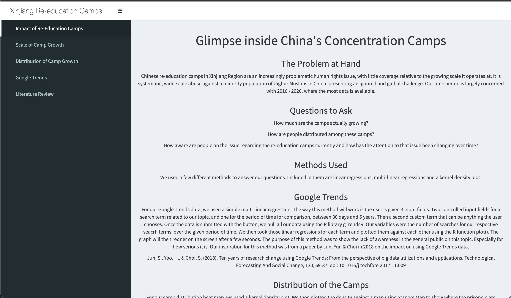
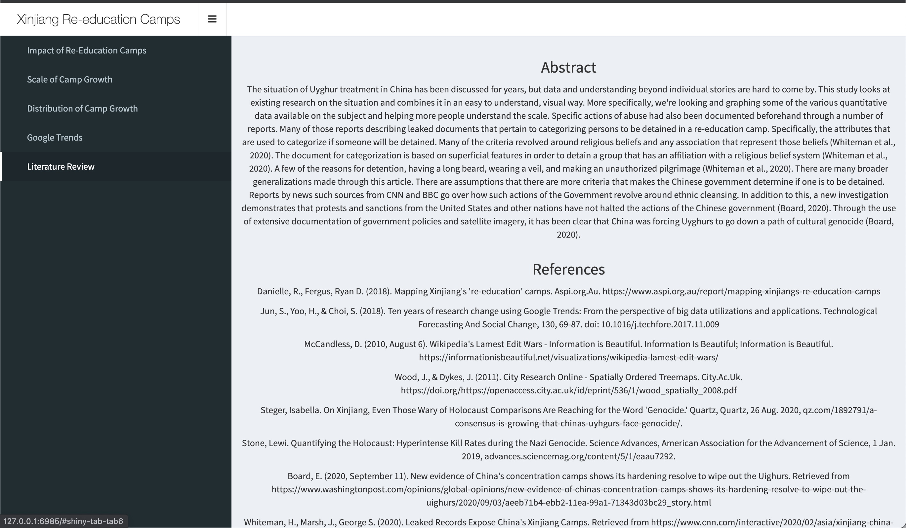
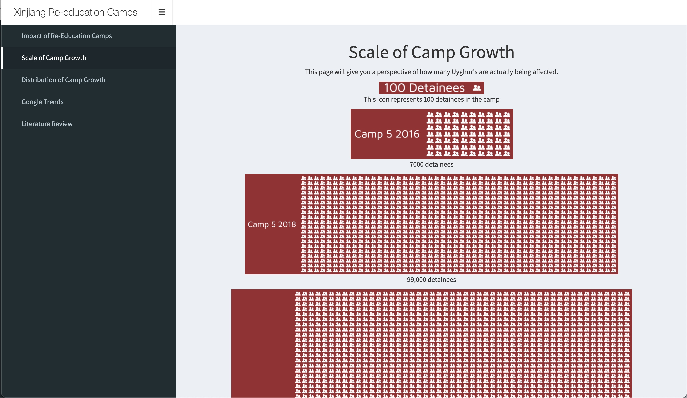
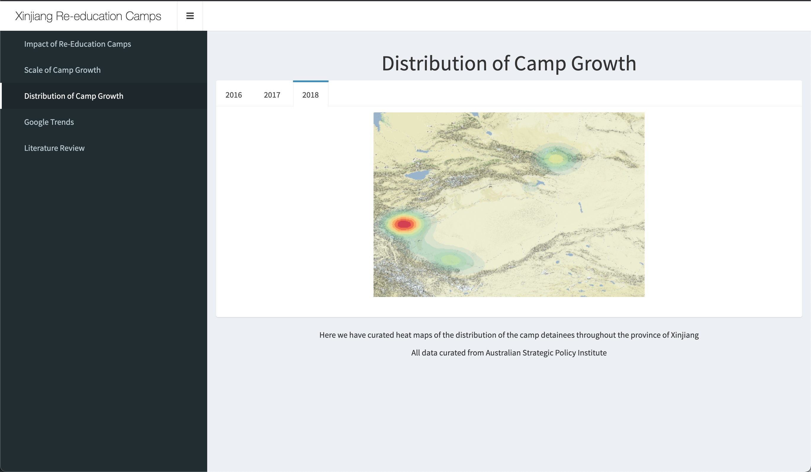
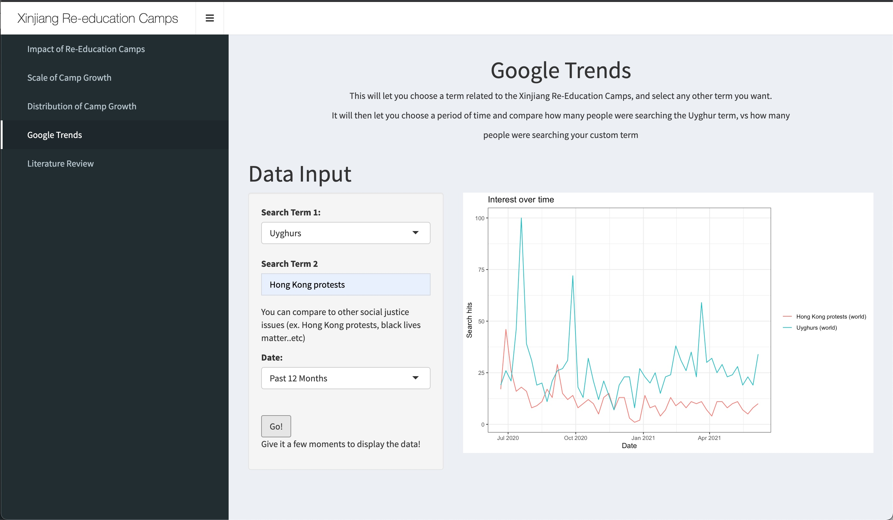

# HumanRightsDashboard
## Description
This project was made in collaboration with Martina Tawedrous, Daniel Ginovker, and Samir Haq.
The dashboard presents the growing issue of Chinese internment camps in Xinjiang.

## Features
* Literature review
* Visual depiction of camp growth rate
* Satellite imagery of camp growth over the years
* Google trends projection to depict awareness of the issue

## Snapshots

## Usage
To view this application, install RStudio and create a new project while importing these files 

